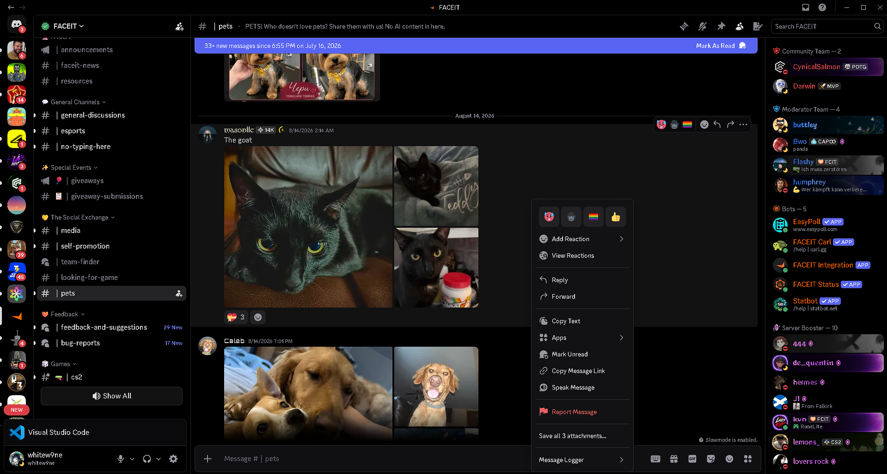

# SaveAll

SaveAllAttachments is a standalone BetterDiscord plugin that downloads every file attached to one Discord message in a single action.

- No external plugin libraries
- No channel scraping
- No automatic background downloads
- No overwriting files with the same name

## Features

- Adds **Save all _N_ attachments...** to the message context menu.
- Saves images, videos, audio, archives, documents, and other actual Discord attachments.
- Lets you choose the destination folder using the native folder picker.
- Remembers the last selected folder for the next folder picker.
- Preserves original filenames where possible.
- Renames collisions safely, such as `image.png`, `image (2).png`, and `image (3).png`.
- Sanitizes filenames that are invalid on Windows.
- Uses up to three concurrent downloads for ordinary files and reduces concurrency for large files.
- Shows a success message or a list of failed downloads.

## Scope

The plugin downloads attachments belonging to the single message you right-clicked. It deliberately does **not** download:

- every attachment in a channel or DM;
- link previews or embedded website media;
- avatars, emojis, stickers, or other Discord assets;
- attachments from messages that are not currently available to your client.

## Installation

See [INSTALLATION.md](INSTALLATION.md) for complete instructions.

1. Install [BetterDiscord](https://betterdiscord.app/).
2. Download `SaveAllAttachments.plugin.js` from this repository or the latest release.
3. In Discord, open **User Settings → BetterDiscord → Plugins → Open Plugins Folder**.
4. Move `SaveAllAttachments.plugin.js` into that folder.
5. Enable **SaveAllAttachments**.

## Usage

1. Find a message containing one or more attached files.
2. Right-click the message.
3. Select **Save all _N_ attachments...**.
4. Choose a folder.

## Privacy and security

SaveAllAttachments does not collect analytics, tokens, passwords, message content, or account information. It performs network requests only after you select its menu action, using the attachment URLs already present in the selected Discord message. The last selected local folder is saved in BetterDiscord's local plugin data.

Always inspect third-party plugin source code before installing it. Client modifications are not officially supported by Discord and may violate Discord's Terms of Service.

## Limitations

- An expired, deleted, inaccessible, or ephemeral attachment can fail to download.
- Discord interface changes can temporarily break context-menu plugins.
- The plugin has been syntax-checked and tested with mocked BetterDiscord APIs, but every release should also be tested manually in the current Discord Stable client before publication.

## Preview

## Development disclosure

The initial implementation and repository documentation were created with OpenAI assistance.

## License

Released under the [MIT License](LICENSE).

## Disclaimer

This project is not affiliated with Discord or BetterDiscord. Use it at your own risk.

